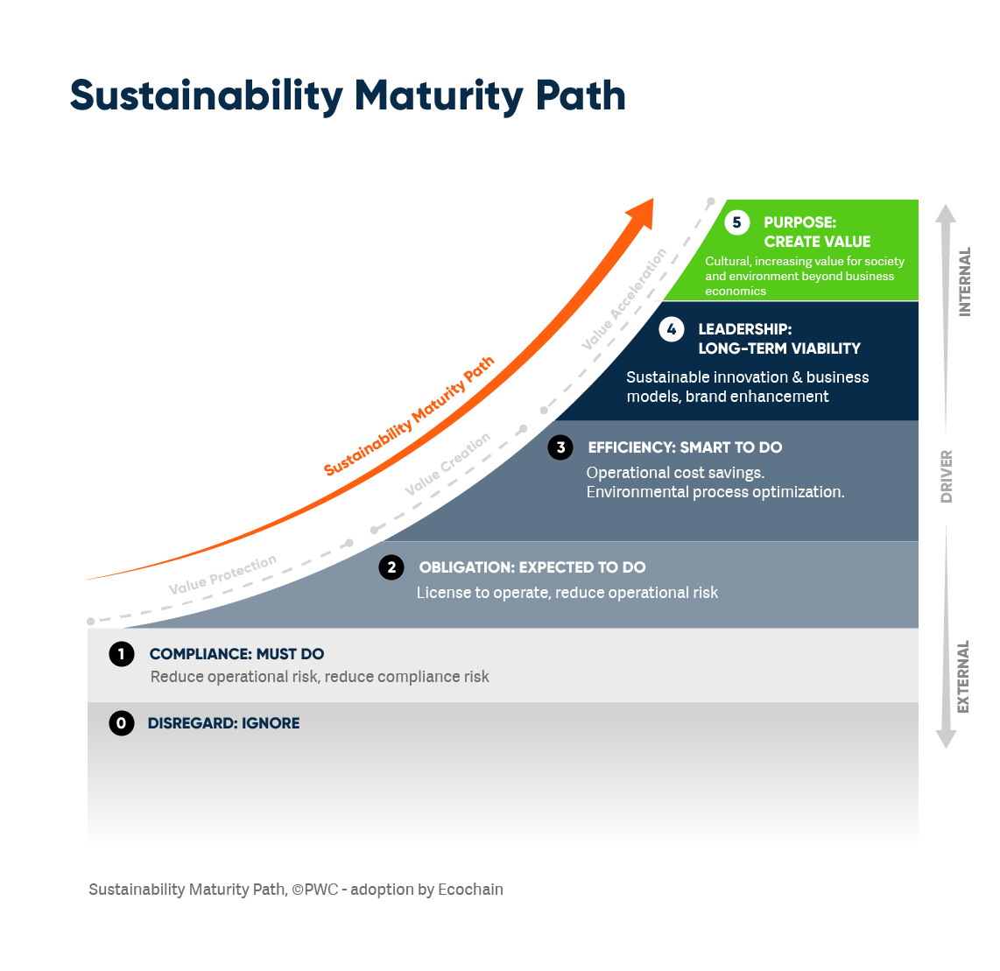
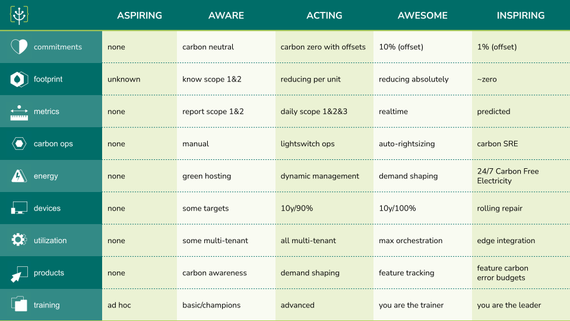

# !This is still work in progress...final version coming soon!

# Digital sustainability for leaders   
The following is a list of material for those in a leadership position. Sustainability has become a leadership pillar, and understanding the problems of climate change and environmental degradation and your associated obligations as well as the potential opportunities offered by sustainability is vital as we move to 2030 and beyond.

For leaders, there are 3 key concepts related to digital sustainability. Keep these concepts in mind as you go through the learning material. 

1) **Reducing cost**. In digital, sustainable solutions are generally cheaper and more cost effective. This could mean making more effective use of resources, using less or making hardware last longer. 
2) **Meeting legal obligations**. There are a range of legal reporting obligations which organisations are expected to meet. These are expected to grow as we move closer to key 2050 milestones, such as 2030. 
3) **Staff retention and recruitment**. There is growing evidence that workers increasingly put an emphasis on an employer's values when thinking about their careers. Being an environmentally responsible employer is no longer an optional 'nice to have', but rather an essential part of your talent strategy. 

Go through the 'Executive Summary' to get started. Working through much of the essential material will build your confidence as a Practitioner. Completing some or all the all the optional material will put you on the path towards Expert. 

## Executive summary
Spend about 90 minutes understanding some of the key terms around digital sustainability and what this means for digital leaders. 

- [ ] **Gartner's Top 10 Tech Trends for 2024** (4:05) Of course AI is the top trend, but it may also surprise you to learn that Gartner sees digital sustainability and green software as #3. Follow the link to fast-forward past the predictable AI part to hear what Gartner has to say on digital sustainability. https://www.youtube.com/live/N_sQbYJl820?si=uzb3S8TwmILxurBq&t=727

- [ ] **e-Estonia podcast: shaping a sustainable digital era** (50:30) Estonia is regularly cited as the global leader in digital government. In this conversational episode, experts from Estonia discuss why they have decided to make sustainability a top objective. The short answer? 1) it's cheaper, 2) it's a legal requirement for all countries and 3) it's vital for attracting and retaining talent. https://e-estonia.com/e-estonia-podcast-shaping-a-sustainable-digital-era/ 

- [ ] **Sustainability Maturity Model Explained**. (10:00) A useful article breaking down the Sustainability Maturity Path (created by PWC), explaining how organisations and leaders can use sustainability to create long-term viability and create value . https://ecochain.com/blog/sustainability-maturity-model/

- [ ] **Green Software Maturity Matrix**. (15:00) A very useful self-assessment tool to check the maturity of your organisation with regards to digital sustainability. Most organisations are at Level 1. https://maturity-matrix.greensoftware.foundation/

## Essential material 

### Short videos on sustainability and leadership

- [ ] **The Impact of Global Trends on Sustainability | University of Cambridge** (2:21) On why high impact leaders need to understand sustainability. Part of the 'High Impact Leadership' course from the University of Cambridge Institute for Sustainability Leadership (CISL). https://www.youtube.com/watch?v=VxH0yra_D2Q

- [ ] **Sustainable Leadership With Paul Polman** (1:57) Paul Polman is a leading thinker on sustainability and leadership. He is the author of 'Net Positive'. Polman is also listed #3 in the 'Thinkers 50' rankings'. https://www.youtube.com/watch?v=80pMz97s6HU

 - [ ] **Leadership for Sustainability: The Both/And Mindset** (2:37) Video from the Oxford Leadership programme on how leaders can adopt a both/and mindset to align corporate financial goals with the drive to make organisations more sustainable. https://www.youtube.com/watch?v=tx2qo46ag8I 

  - [ ] **What is Doughnut Economics? - with Kate Raworth** (1:35) The book 'Doughnut Economics' by Kate Raworth has been an inspiration to many. In this very short introduction she explains the meaning of the term and why we need to move to such a model. https://www.youtube.com/watch?v=kxQeb2PDz9M
 
 ### Longer watches on sustainability 

 - [ ] **Smart green world? Making digitalization work for sustainability** (18:12) Excellent TEDx talk by Tilmann Santarius on digital sufficiency. This talk examines both the direct impacts of digital on the environment, but also the potential for digital to improve our environmental impact. But it can often be a complex balance, due to the tendency for digital to increase demand. https://www.youtube.com/watch?v=lNkaGLMIm_Q 

 - [ ]  **What does it all mean: Net-zero, carbon neutral, climate positive, carbon negative? by Asim Hussain** (20:24) Good breakdown of some of the crucial terminology, focussed specifically on digital emissions. 20 minutes, broken into clear chapters. 
https://youtu.be/HXEnbi64TdQ?si=Ff4eGg2uo4OUxsQm 

* [ ] **BBC News: AI Decoded** Excellent report on the environmental impacts of AI with a panel of very knowledgable experts. Although it's about AI, it covers many other important areas of digital sustainability. https://www.youtube.com/watch?v=fjNacsyp28s

- [ ] **Defining Sustainability: Absolutely** (11:30) TEDx talk by Anjila Hjalsted on the meaning of 'sustainability'. Leaders must understand what sustainability really means, through the use of better data. 
 https://www.youtube.com/watch?v=B-dCmbViDEQ 

 - [ ] **The New Leader** (20:46) TEDxStanford talk with Julia Novy. Insightful talk on the importance of understanding real user needs to create more sustainable solutions for complex systems. https://www.youtube.com/watch?v=DkrS3HZqXrQ 

### Legal obligations and other government guidelines 

* UK becomes first major economy to pass net zero emissions law - https://www.gov.uk/government/news/uk-becomes-first-major-economy-to-pass-net-zero-emissions-law

* UK Government Sustainable ICT (GDSA blog) - The Government Digital Sustainability Alliance is broad coalition of technology suppliers aimed at reducing the emissions from ICT. Regular updates are posted here. https://sustainableict.blog.gov.uk/category/sustainable-ict/gdsa/

* GOV.UK Technology Code of Practice (point 12 - Make your technology sustainable) https://www.gov.uk/guidance/the-technology-code-of-practice#make-your-technology-sustainable

 * Greening government: ICT and digital services strategy 2020-2025  https://www.gov.uk/government/publications/greening-government-ict-and-digital-services-strategy-2020-2025/greening-government-ict-and-digital-services-strategy-2020-2025 

 * Policy paper - Digital development strategy 2024 to 2030 (FCDO) - useful reference point. https://www.gov.uk/government/publications/digital-development-strategy-2024-to-2030/digital-development-strategy-2024-to-2030#chapter-5----digital-sustainability-harnessing-digital-technologies-for-climate-and-the-environment

*  Generative AI Framework for HMG - includes good general guidance related to sustainability. https://www.gov.uk/government/publications/generative-ai-framework-for-hmg/generative-ai-framework-for-hmg-html

### Staff engagement, recruitment and retention 

* From Quiet Quitting to Conscious Quitting - https://www.paulpolman.com/conscious-quitting-has-arrived/

* Climate quitting - younger workers voting with their feet on employer’s ESG commitments - https://kpmg.com/uk/en/home/media/press-releases/2023/01/climate-quitting-younger-workers-voting-esg.html

* Sustainability, a surprisingly successful KPI: GreenOps survey results - https://climateaction.tech/blog/sustainability-kpi-greenops-survey-results/

## Optional material

### 1. Podcasts 

- [ ] **CXO Bytes:** new podcast hosted by Sanjay Podder, Chairperson of the Green Software Foundation, on tech leadership and sustainability. https://podcasts.bcast.fm/cxo-bytes 

- [ ]   **Green IO:** weekly podcast hosted by Gaël Duez on green software and ICT, with frequent interviews looking at sustainable design practices. Recommended. https://greenio.gaelduez.com/ 

- [ ] **Why All Executives Should Focus on Sustainable Technology to Drive Growth**. One-off from Gartner. https://www.gartner.com/en/podcasts/thinkcast/why-all-executives-should-focus-on-sustainable-technology-to-drive-growth

### 2. People to follow 

* Paul Polman https://www.linkedin.com/in/paulpolman/ 
Kate Raworth 
* **Oliver Cronk** - Sustainable Tech Director at Scott Logic. Leads on the Technology Carbon Standard initiative. https://www.linkedin.com/in/cronky/
* **Asim Hussain** - Executive Director of the Green Software Foundation. https://www.linkedin.com/in/jawache/
* **Eric Zie** - CEO and Founder GoCodeGreen, author of Decarbonise Digital. https://www.linkedin.com/in/ericzie/
* **Mark Butcher** - outspoken GreenOps advocate abd Big Tech critic. https://www.linkedin.com/in/markbutcher/
* **Peter Campbell** - Director of Green Software at Kainos and author of Digital Sustainability: The Ned for Greener Software. https://www.linkedin.com/in/petercampell/

### 3. Books and longer reads

The following are recommended for anyone wishing to understand leadership from a sustainability perspective. For books related to the more technical aspects of digital sustainability, check the [technologists learning pathway](technologists.md)

* [ ] **Sustainable IT Playbook for Technology Leaders** - Very good audio book, recommended. Covers all aspects of developing a sustainable ICT strategy. 
https://www.audible.co.uk/pd/Sustainable-IT-Playbook-for-Technology-Leaders-Audiobook/B0BSRCBCRL 

* [ ] **Doughnut Economics: Seven Ways to Think Like a 21st-Century Economist** A sustainability and economics best seller. https://www.amazon.co.uk/Doughnut-Economics-Seven-21st-Century-Economist/dp/1847941397/

* [ ] **Net Positive: How Courageous Companies Thrive by Giving More Than They Take** - Paul Polman argues that the companies of the future will profit by fixing the world's problems, not creating them. https://www.amazon.co.uk/Net-Positive-Courageous-Companies-Thrive/dp/1647821304

### 4. Articles to read
There are hundreds of recent articles on these topics, here is a sampling of a few which are of interest.

#### International perspectives

* Green IT (French government strategy) - https://www.ecologie.gouv.fr/politiques-publiques/green-it

* Singapore wants to become a green computing hub. Here’s how it’s getting started. - https://govinsider.asia/intl-en/article/singapore-wants-to-become-a-green-computing-hub-heres-how-its-getting-started 

* Estonia to become the greenest digital government in the world - https://e-estonia.com/estonia-to-become-the-greenest-digital-government-in-the-world/

* The UK government's IT carbon footprint has got worse - the transparency is welcome - https://www.csofutures.com/news/the-uk-governments-it-carbon-footprint-has-got-worse-and-thats-not-all-bad-news/ 

* Building trust in the digital era: achieving Scotland's aspirations as an ethical digital nation - https://www.gov.scot/publications/building-trust-digital-era-achieving-scotlands-aspirations-ethical-digital-nation/pages/6/ 

* Exploring how we help the public sector become digitally sustainable (Welsh government) - https://digitalpublicservices.gov.wales/our-work/exploring-how-we-help-public-sector-become-digitally-sustainable 

#### Greenwashing 

* **Google and Amazon are top PPA buyers, but their net-zero claims are greenwash** - unsure about about the claims by Big Tech on renewable energy? There is a lot out there on this, and Data Center Dynamics has put together a good summmary. https://www.datacenterdynamics.com/en/news/google-and-amazon-are-top-ppa-buyers-but-their-net-zero-claims-are-greenwash/

* **Our Digital Greenwashing Guide** - good summary of issues related to digital greenwashing. https://www.mightybytes.com/blog/digital-greenwashing-guide/ 

* **What is greenwashing (and how can you spot it)?** - a more general article on greenwashing in business. https://www.ucem.ac.uk/whats-happening/articles/greenwashing/ 

#### Data centres 
* **Amazon, Google, Microsoft: Here's Who Has the Greenest Cloud** - https://www.wired.com/story/amazon-google-microsoft-green-clouds-and-hyperscale-data-centers/
* **Why Cloud Zombies Are Destroying the Planet and How You Can Stop Them** - https://www.infoq.com/news/2023/03/stop-cloud-zombies-qcon/

* **The Staggering Ecological Impacts of Computation and the Cloud** - shorter version of the article above. https://thereader.mitpress.mit.edu/the-staggering-ecological-impacts-of-computation-and-the-cloud/

#### Hardware and e-waste 
* **Your old phone is full of precious metals** - https://www.bbc.com/future/article/20161017-your-old-phone-is-full-of-precious-metals

* **UK generated 2nd largest amount of e-waste as a country in 2022** - eye-opening summary of the UK's e-waste problem. https://solar.lowtechmagazine.com/2020/12/how-and-why-i-stopped-buying-new-laptops/ 

## Glossary
Are you new to terms like Scope 3, GHGs, the Rebound Effect SDGs? If so, please make use of the glossary to get familiar with the relevant concepts and terminology. [Digital sustainability glossary](glossary.md).