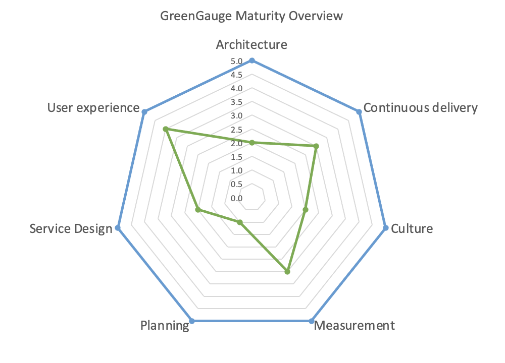

# !This is still work in progress...final version coming soon!

# Digital sustainability for leaders   
The following is a list of material designed for those in leadership positions. Sustainability has become a leadership pillar, and understanding the problems, your obligations and the opportunities is vital as we move to 2030 and beyond. Working through most of the  material will build your confidence as a Practitioner. Completing the all the material will put you on the path towards Expert. 

https://www.gartner.com/en/information-technology/insights/top-technology-trends 

## Essentials

### 1. Self-evaluation tools
You are no doubt familiar with maturity matrices. They are a good way to evaluate the maturity of your team and organisation. The following two are focussed on digital sustainability, and familiarity with these is an excellent way  to measure and improve the sustainability of your team and the products you are building.  
- [ ] **Green Software Maturity Matrix**. Self-evaluation tool by the GSF to help organisations understand their level of maturity in this area. This is good, but also high level. A sample output from GreenGauge can be found below. https://maturity-matrix.greensoftware.foundation/

- [ ] **GreenGauge.** GreenGauge is an open source tool developed by Kainos to support https://github.com/KainosSoftwareLtd/GreenGauge/blob/main/docs/service-design-matrix.md

- [ ] **Assessment of my individual / professional digital environmental footprint in kg CO2 eq.** Excellent tool for estimating the emissions from typical work and home digital activities, could be scaled up to a team. Unfortunately the calculator only has carbon intensity data for France, Belgium and the Netherlands. Belgium is the most similar to the UK for this (see https://app.electricitymaps.com to understand this further). https://myimpact.isit-europe.org/

### 2. Guidelines
- [ ] **W3C Web Sustainability Guidelines, 1.0.** A new initiative, covers business, design and technology aspects of digital services. See https://w3c.github.io/sustyweb/. Condensed version: https://w3c.github.io/sustyweb/glance.html and quick reference: https://w3c.github.io/sustyweb/quickref.html

- [ ] **GOV.UK Technology Code of Practice**. Point 12 outlines the GOV.UK position on sustainability in ICT. See https://www.gov.uk/guidance/make-your-technology-sustainable 

- [ ] **Planet Centred Design**. A new proposal by Defra to support those designing and building digital services. See https://defradigital.blog.gov.uk/2023/03/06/how-being-planet-centric-can-really-make-a-difference-when-designing-services/ and https://drive.google.com/file/d/161GLM3MiuLmehr4zR6yfmFRV67ON4ml1/view 

 

### Videos

- [ ]  **What does it all mean: Net-zero, carbon neutral, climate positive, carbon negative? by Asim Hussain** - Good breakdown of some of the crucial terminology, focussed specifically on digital emissions. 20 minutes, broken into clear chapters. 
https://youtu.be/HXEnbi64TdQ?si=Ff4eGg2uo4OUxsQm 

* [ ] **BBC News: AI Decoded** Excellent report on the environmental impacts of AI with a panel of very knowledgable experts. Although it's about AI, it covers many other important areas of digital sustainability. https://www.youtube.com/watch?v=fjNacsyp28s

* **Clouded II: Does Cloud Cost the Earth?** - Feature-length documentary on the environmental impacts of cloud computing. Engrossing, even for non-techies. https://www.clouded.tv/ (trailer at https://www.youtube.com/watch?v=CPLMyY71_eM)

### Legislation 

### Books and longer reads

The following are recommended for anyone wishing to understand leadership from a sustainability perspective. For books related to the more technical aspects of digital sustainability, check the [technologists learning pathway](technologists.md)

**Sustainable IT Playbook for Technology Leaders**
https://www.audible.co.uk/pd/Sustainable-IT-Playbook-for-Technology-Leaders-Audiobook/B0BSRCBCRL 
Very good audio book, recommended.

https://www.amazon.co.uk/Doughnut-Economics-Seven-21st-Century-Economist/dp/1847941397/

https://www.amazon.co.uk/Net-Positive-Courageous-Companies-Thrive/dp/1647821304

### Articles to read
There are hundreds of recent articles on these topics, here is a sampling of a few which are of interest.

#### General interest
* **The Staggering Ecological Impacts of Computation and the Cloud** - https://thereader.mitpress.mit.edu/the-staggering-ecological-impacts-of-computation-and-the-cloud/

#### Greenwashing 

* **Google and Amazon are top PPA buyers, but their net-zero claims are greenwash** - unsure about about the claims by Big Tech on renewable energy? There is a lot out there on this, and Data Center Dynamics has put together a good summmary. https://www.datacenterdynamics.com/en/news/google-and-amazon-are-top-ppa-buyers-but-their-net-zero-claims-are-greenwash/

* **Our Digital Greenwashing Guide** - good summary of issues related to digital greenwashing. https://www.mightybytes.com/blog/digital-greenwashing-guide/ 

* **What is greenwashing (and how can you spot it)?** - a more general article on greenwashing in business. https://www.ucem.ac.uk/whats-happening/articles/greenwashing/ 

#### Data centres 
* **Amazon, Google, Microsoft: Here's Who Has the Greenest Cloud** - https://www.wired.com/story/amazon-google-microsoft-green-clouds-and-hyperscale-data-centers/
* **Why Cloud Zombies Are Destroying the Planet and How You Can Stop Them** - https://www.infoq.com/news/2023/03/stop-cloud-zombies-qcon/

* **The Staggering Ecological Impacts of Computation and the Cloud** - shorter version of the article above. https://thereader.mitpress.mit.edu/the-staggering-ecological-impacts-of-computation-and-the-cloud/

#### Hardware and e-waste 
* **Your old phone is full of precious metals** - https://www.bbc.com/future/article/20161017-your-old-phone-is-full-of-precious-metals

* **UK generated 2nd largest amount of e-waste as a country in 2022** - eye-opening summary of the UK's e-waste problem. https://solar.lowtechmagazine.com/2020/12/how-and-why-i-stopped-buying-new-laptops/ 

* **How and Why I Stopped Buying New Laptops** - informative, fun and practical article about keeping your laptop for longer, the why and the how. 

#### Climate psychology  

* **Do men and women think about climate change differently?** - condensed version of the research discussed above. https://www.economist.com/graphic-detail/2022/07/22/do-men-and-women-think-about-climate-change-differently 

* **Globally representative evidence on the actual and perceived support for climate action** - global survey results from 130,000 people on attitudes towards climate change. https://www.nature.com/articles/s41558-024-01925-3
* **Sustainability, a surprisingly successful KPI: GreenOps survey results** - survey  results, indicating that tech workers care more about carbon than cost, and the benefits of a GreenOps approach. https://climateaction.tech/blog/sustainability-kpi-greenops-survey-results/

### People to follow
LinkedIn is a very useful tool for engaging with the Green IT movement. The following individuals have made some outstanding contributions to digital sustainability and are worth following.

* **Anne Currie** - co-author of Building Green Software, green software trainer and advocate. https://www.linkedin.com/in/annecurrie/
* **Asim Hussain** - Executive Director of the Green Software Foundation. https://www.linkedin.com/in/jawache/
* **Professor Ed Hawkins MBE** - Professor of Climate Science, creator of Warming Stripes. https://www.linkedin.com/in/edhawkinsclimate/
* **Eric Zie** - CEO and Founder GoCodeGreen, author of Decarbonise Digital. https://www.linkedin.com/in/ericzie/
* **Gael Duez** - Podcast host of Green.io. https://www.linkedin.com/in/gaelduez/ 
* **Gerry McGovern** - digital sustainability industry gadfly, author of World Wide Waste. https://www.linkedin.com/in/gerry-mcgovern-07876469/ 
* **Hannah Smith** - Director of Operations at the Green Web Foundation. https://www.linkedin.com/in/hanopcan/
* **Mark Butcher** - outspoken GreenOps advocate abd Big Tech critic. https://www.linkedin.com/in/markbutcher/
* **Maxime Blondeau** - Photographer, map-maker and storyteller. Posts are in French,, but his photos and maps are amazing. https://www.linkedin.com/in/maxime-blondeau-%F0%9F%8C%B1-%E2%99%BE-a71b6521/
* **Oliver Cronk** - Sustainable Tech Director at Scott Logic. Leads on the Technology Carbon Standard initiative. https://www.linkedin.com/in/cronky/
* **Peter Campbell** - Director of Green Software at Kainos and author of Digital Sustainability: The Ned for Greener Software. https://www.linkedin.com/in/petercampell/
* **Sara Bergman** - co-author of Building Green Software. https://www.linkedin.com/in/sara-bergman1/ 
* **Tim Frick** - founder of Mightybytes and author of Designing for Sustainability. https://www.linkedin.com/in/timfrick/    
* **Tom Greenwood** - co-founder of Wholegrain Digital, author of Sustainable Web Design. https://www.linkedin.com/in/tomgreenwood/     

## Glossary
Are you new to terms like Scope 3, GHGs, the Rebound Effect SDGs? If so, please make use of the glossary to get familiar with the relevant concepts and terminology. [Digital sustainability glossary](glossary.md).

### 2. Playbooks and longer reads 

- [ ] **How to become a Climate-Conscious Product Manager** by François Burra. Excellent downloadable resource pack. http://climateproductleaders.org/

- [ ] **Humanity-Centered Design** by Don Norman. The renowned design thinker has adapted his approach in the face of the environmental crisis. Gone are the terms 'user centred' and even 'human centred'. Don now asks us to instead be 'humanity centred'. Read and learn more here: https://www.interaction-design.org/literature/topics/humanity-centered-design

- [ ] **Responsible tech playbook** by Thoughtworks. This covers much for than sustainability, with a real focus on ethics in the design process. Filled with useful ideas and activities. https://www.thoughtworks.com/en-gb/about-us/social-change/responsible-tech-playbook

- [ ] **SustAIn - Step by Step Towards Sustainable AI** https://sustain.algorithmwatch.org/en/step-by-step-towards-sustainable-ai/ 

### 3. Podcasts 

- [ ]   **Green IO:** weekly podcast hosted by Gaël Duez on green software and ICT, with frequent interviews looking at sustainable design practices. Recommended. https://greenio.gaelduez.com/ 

* **Permaculture for Agile teams – Amy Wagner on The Product Experience**. https://www.mindtheproduct.com/permaculture-for-agile-teams-amy-wagner-on-the-product-experience/

### 4. Online courses
#### E-learning 
- [ ] **Career Essentials in Sustainable Tech by Microsoft and LinkedIn.** About 3.5 hours. A good overall introduction to the topic of sustainability. Covers areas such as Net Zero, carbon accounting, the circular economy, LCAs, procurement as well as some light-touch information on why digital services must also transition to being sustainable. The digital part of the course makes some claims that could be questioned or challenged. Requires a LinkedIn account. 
https://www.linkedin.com/learning/paths/career-essentials-in-sustainable-tech-by-microsoft-and-linkedin
 
### 5. Articles to read
There are hundreds of recent articles on these topics, here is a sampling of a few which are of interest.

#### General interest
* **The Staggering Ecological Impacts of Computation and the Cloud** - https://thereader.mitpress.mit.edu/the-staggering-ecological-impacts-of-computation-and-the-cloud/
* **The UK government's IT carbon footprint has got worse - the transparency is welcome** - https://www.csofutures.com/news/the-uk-governments-it-carbon-footprint-has-got-worse-and-thats-not-all-bad-news/

#### Agile
* **Leveraging the Agile Manifesto for More Sustainability** - https://www.infoq.com/articles/agile-manifesto-sustainability/

* **Be the Change – Sustainable Home and Agile Working** - Be the Change – Sustainable Home and Agile Working

#### Greenwashing and team engagement 

* **Our Digital Greenwashing Guide** - good summary of issues related to digital greenwashing. https://www.mightybytes.com/blog/digital-greenwashing-guide/ 

* **Sustainability, a surprisingly successful KPI: GreenOps survey results** - https://climateaction.tech/blog/sustainability-kpi-greenops-survey-results/

#### Measurement
* **Cost as a proxy for carbon – the inconvenient truth** https://www.kainos.com/insights/blogs/cost-as-a-proxy-for-carbon-the-inconvenient-truth-part-1 and https://www.kainos.com/insights/blogs/cost-as-a-proxy-for-carbon-the-inconvenient-truth-part-2

* **What is a Good Digital Carbon Rating?** - https://www.mightybytes.com/blog/digital-carbon-rating/ 

#### Sustainability statements for websites

* **Social Impact and Sustainability on Corporate Websites** - some basic guidance. https://www.nngroup.com/articles/corporate-social-responsibility/ 

* **Digital Sustainability (Unilever)** - a good example of a digital sustainability statement. https://www.unilever.com/digital-sustainability/

## Glossary
Are you new to terms like Scope 3, GHGs, the Rebound Effect SDGs? If so, please make use of the glossary to get familiar with the relevant concepts and terminology. [Digital sustainability glossary](glossary.md).

https://w3c.github.io/sustyweb/drafts/policies.html

https://github.com/KainosSoftwareLtd/GreenGauge/blob/main/docs/service-design-matrix.md

 
BCS 6-episode podcast on Net Zero. Lots of good topics by the look of it (but I haven't listened to any yet - I will get around to it). https://netzerodigital.bcs.org/media/podcasts/  

https://www.cisl.cam.ac.uk/education/learn-online 

https://sas-dhrh.github.io/dhcc-toolkit/toolkit/teaching.html 

### 4. Articles to read
There are hundreds of recent articles on these topics, here is a sampling of a few which are of interest.

https://www.gartner.com/en/podcasts/thinkcast/why-all-executives-should-focus-on-sustainable-technology-to-drive-growth

https://kpmg.com/uk/en/home/media/press-releases/2023/01/climate-quitting-younger-workers-voting-esg.html

https://www.linkedin.com/in/paulpolman/

## Glossary
Are you new to terms like Scope 3, GHGs, the Rebound Effect SDGs? If so, please make use of the glossary to get familiar with the relevant concepts and terminology. [Digital sustainability glossary](glossary.md).

https://www.cisl.cam.ac.uk/education/learn-online/high-impact-leadership-online

74 key practices for a sustainable digitalization https://resilio-solutions.com/wp-content/uploads/2023/02/Club-RGIT-15.07.22_v1.1_EN.pdf 