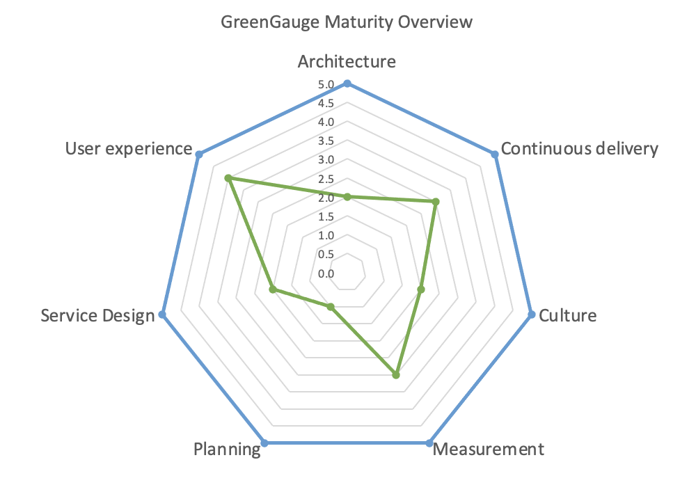

# Digital sustainability for product and delivery managers   
The following is a list of material designed to support those in both product and delivery roles to reach a level of Practitioner. While there are clear and obvious differences in these two roles, there is also a good deal of shared interest from a sustainability perspective. Completing the optional material will put you on the path towards Expert level. 

## Essential training and resources 

### 1. Green software training 
These two courses are essential for understanding the basics of Green Software and should only take a couple of hours to complete. They are free and open to all.

- [ ]  **Sustainable software engineering overview**
Great into video series by Asim Hussain (Green Software Foundation). Very digestible, only takes about 30 minutes to complete. https://learn.microsoft.com/en-us/training/modules/sustainable-software-engineering-overview/
- [ ]  **Green Software Practitioner**
Slightly more in-depth online course. Takes 2-3 hours to complete. Recommended. Take the short exam to get certified. https://learn.greensoftware.foundation/

### 2. Videos
- [ ]  **What does it all mean: Net-zero, carbon neutral, climate positive, carbon negative? by Asim Hussain** Good breakdown of some of the crucial terminology, focussed speficically on digital emissions. 20 minutes, broken into clear chapters. 
https://youtu.be/HXEnbi64TdQ?si=Ff4eGg2uo4OUxsQm 

- [ ] **Beth yw cynaliadwyedd digidol? / What is digital sustainability?** Panel discussion by the Centre for Digital Public Services in Wales. Covers all the main topics related to digital sustainability, especially from a UK government perspective. Panellists include Hannah Smith from the Green Web Foundation as well experts from Defra, Wholegrain Digital and the Centre for Sustainability. Despite the title, the content is all in English. The first 25 minutes are devoted to each panelist speaking for 5 minutes, followed by a wider discusson. It's generally a non-technical discusson, so suitable for all. 1 hour 12 minutes, but broken up into clear chapters. 
https://youtu.be/Wn5urKcquFE?si=84Th0OkXNlEPjvGd

* [ ] **BBC News: AI Decoded** Excellent report on the environmental impacts of AI with a panel of very knowledgable experts. Although it's about AI, it covers many other important areas of digital sustainability. https://www.youtube.com/watch?v=fjNacsyp28s

### 3. Self-evaluation tools
You are no doubt familiar with maturity matrices. They are a good way to evaluate the maturity of your team and organisation. The following two are focussed on digital sustainability, and familiarity with these is an excellent way  to measure and improve the sustainability of your team and the products you are building.  
- [ ] **Green Software Maturity Matrix**. Self-evaluation tool by the GSF to help organisations understand their level of maturity in this area. This is good, but also high level. A sample output from GreenGauge can be found below. https://maturity-matrix.greensoftware.foundation/

- [ ] **GreenGauge.** GreenGauge is an open source tool developed by Kainos to support https://github.com/KainosSoftwareLtd/GreenGauge/blob/main/docs/service-design-matrix.md

- [ ] **Assessment of my individual / professional digital environmental footprint in kg CO2 eq.** Excellent tool for estimating the emissions from typical work and home digital activities, could be scaled up to a team. Unfortunately the calculator only has carbon intensity data for France, Belgium and the Netherlands. Belgium is the most similar to the UK for this (see https://app.electricitymaps.com to understand this further). https://myimpact.isit-europe.org/

### 4. Guidelines
- [ ] **W3C Web Sustainability Guidelines, 1.0.** A new initiative, covers business, design and technology aspects of digital services. See https://w3c.github.io/sustyweb/. Condensed version: https://w3c.github.io/sustyweb/glance.html and quick reference: https://w3c.github.io/sustyweb/quickref.html

- [ ] **GOV.UK Technology Code of Practice**. Point 12 outlines the GOV.UK position on sustainability in ICT. https://www.gov.uk/guidance/make-your-technology-sustainable 

- [ ] **Web Sustainability Guidelines.**
Now in their sixth draft, the Web Sustainability Guidelines consist of 94 recommendations to help teams create more sustainable digital products and services. https://sustainablewebdesign.org/guidelines/

- [ ] **Planet Centred Design**. A new proposal by Defra to support those designing and building digital services. See https://defradigital.blog.gov.uk/2023/03/06/how-being-planet-centric-can-really-make-a-difference-when-designing-services/ and https://drive.google.com/file/d/161GLM3MiuLmehr4zR6yfmFRV67ON4ml1/view 

## Websites to explore

### 1. Carbon intensity tools
Understanding carbon intensity, or the 'cleanness' of your electricity is an important component of a less environmentally damaging Internet. These interactive, map-based sites bring an abstract concept to life. 
* **Electricity Maps:** emissions factors worldwide. https://app.electricitymaps.com/map, https://electricityproduction.uk/, https://www.energydashboard.co.uk/map 

* **UK National Grid maps** - there are many sites and APIs offering this, here are some good ones. https://www.carbonintensity.org.uk/, https://www.energydashboard.co.uk/live and https://electricityproduction.uk/ 

### 2. Web page analysis tools
Web-based tools to rate web pages in terms of sustainability. Only useful for analysis of the front end. 
* **Ecograder** - online tool (one of many) which creates a report on how well a web page performs from an environmental perspective. There are many similar tools out there, but Ecograder produces some of the clearest and most actionable reports.   https://ecograder.com/ 
* **Beacon** - Similar to Ecograder. https://digitalbeacon.co/
* **Globemallow** - Similar to Ecograder. https://globemallow.io/#api

## Optional training materials 

### 1. Books

- [ ] **Building Green Software**.
Good and very broad introduction to Green Software. Aimed more at those new to Green Software, it covers all the main topics. Could be strengthened by more practical examples or how-to advice.  
https://learning.oreilly.com/library/view/building-green-software/9781098150617/ 

- [ ] **Digital Sustainability: The Need for Greener Software.** As with the previous title, this book covers all of the typical topics well for the subject area. This book also includes some excellent material on product design and software delivery. https://www.amazon.co.uk/gp/product/B0CYXVD5L2/

### 2. Playbooks and longer reads 

- [ ] **How to become a Climate-Conscious Product Manager** by François Burra. Excellent downloadable resource pack. http://climateproductleaders.org/

- [ ] **Humanity-Centered Design** by Don Norman. The renowned design thinker has adapted his approach in the face of the environmental crisis. Gone are the terms 'user centred' and even 'human centred'. Don now asks us to instead be 'humanity centred'. Read and learn more here: https://www.interaction-design.org/literature/topics/humanity-centered-design

- [ ] **Responsible tech playbook** by Thoughtworks. This covers much for than sustainability, with a real focus on ethics in the design process. Filled with useful ideas and activities. https://www.thoughtworks.com/en-gb/about-us/social-change/responsible-tech-playbook

- [ ] **SustAIn - Step by Step Towards Sustainable AI** https://sustain.algorithmwatch.org/en/step-by-step-towards-sustainable-ai/ 

### 3. Podcasts 

- [ ]   **Green IO:** weekly podcast hosted by Gaël Duez on green software and ICT, with frequent interviews looking at sustainable design practices. Recommended. https://greenio.gaelduez.com/ 

* **Permaculture for Agile teams – Amy Wagner on The Product Experience**. https://www.mindtheproduct.com/permaculture-for-agile-teams-amy-wagner-on-the-product-experience/

### 4. Online courses
#### E-learning 
- [ ] **Career Essentials in Sustainable Tech by Microsoft and LinkedIn.** About 3.5 hours. A good overall introduction to the topic of sustainability. Covers areas such as Net Zero, carbon accounting, the circular economy, LCAs, procurement as well as some light-touch information on why digital services must also transition to being sustainable. The digital part of the course makes some claims that could be questioned or challenged. Requires a LinkedIn account. 
https://www.linkedin.com/learning/paths/career-essentials-in-sustainable-tech-by-microsoft-and-linkedin
 

### 5. Articles to read
There are hundreds of recent articles on these topics, here is a sampling of a few which are of interest.

#### General interest
* **The Staggering Ecological Impacts of Computation and the Cloud** - https://thereader.mitpress.mit.edu/the-staggering-ecological-impacts-of-computation-and-the-cloud/
* **The UK government's IT carbon footprint has got worse - the transparency is welcome** - https://www.csofutures.com/news/the-uk-governments-it-carbon-footprint-has-got-worse-and-thats-not-all-bad-news/

#### Agile
* **Leveraging the Agile Manifesto for More Sustainability** - https://www.infoq.com/articles/agile-manifesto-sustainability/

* **Be the Change – Sustainable Home and Agile Working** - Be the Change – Sustainable Home and Agile Working

#### Greenwashing and team engagement 

* **Our Digital Greenwashing Guide** - good summary of issues related to digital greenwashing. https://www.mightybytes.com/blog/digital-greenwashing-guide/ 

* **Sustainability, a surprisingly successful KPI: GreenOps survey results** - https://climateaction.tech/blog/sustainability-kpi-greenops-survey-results/

#### Measurement
* **Cost as a proxy for carbon – the inconvenient truth** https://www.kainos.com/insights/blogs/cost-as-a-proxy-for-carbon-the-inconvenient-truth-part-1 and https://www.kainos.com/insights/blogs/cost-as-a-proxy-for-carbon-the-inconvenient-truth-part-2

* **What is a Good Digital Carbon Rating?** - https://www.mightybytes.com/blog/digital-carbon-rating/ 

#### Sustainability statements for websites

* **Social Impact and Sustainability on Corporate Websites** - some basic guidance. https://www.nngroup.com/articles/corporate-social-responsibility/ 

* **Digital Sustainability (Unilever)** - a good example of a digital sustainability statement. https://www.unilever.com/digital-sustainability/

## Glossary
Are you new to terms like Scope 3, GHGs, the Rebound Effect SDGs? If so, please make use of the glossary to get familiar with the relevant concepts and terminology. [Digital sustainability glossary](glossary.md).